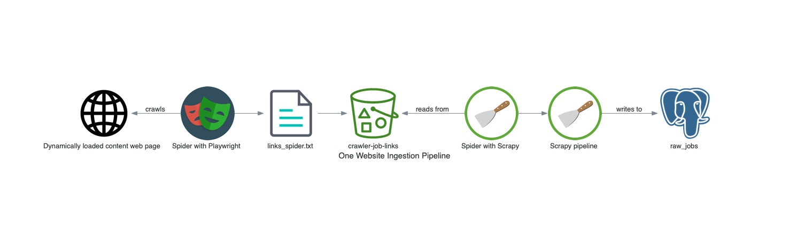

# data-job-crawler

Scrape job listings in a formatted manner.

# Architecture



# Testing

## End-to-end tests

- Compare number of jobs from website with number of links scraped
- Search for first and last job links
- Compare number of records in the database before and after
- Check number of new records

```sql
select created_at, count(*) 
from raw_jobs 
group by created_at 
order by created_at desc;
```

## Data quality tests

Check a few websites  
```sql
select * from raw_jobs where created_at = '2023-03-26';
```
