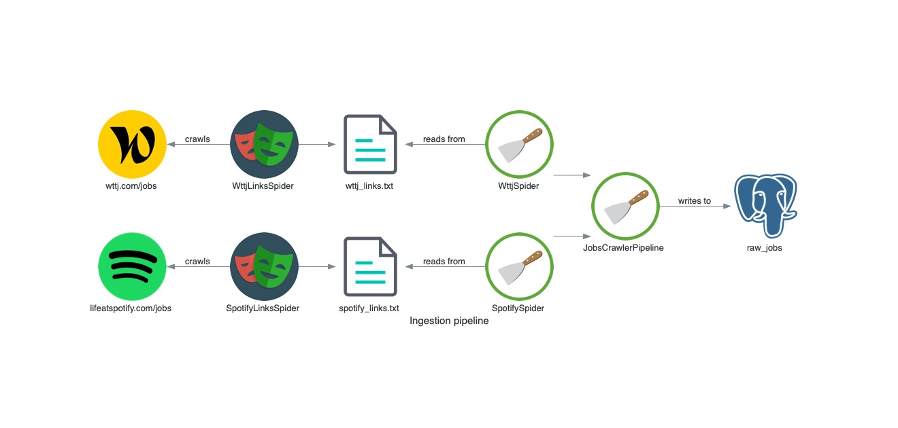

# data-job-crawler

Scrape job listings in a formatted manner.

# Architecture



# Testing

## Check if all jobs are scraped
- Compare number of jobs from website with number of links in [bucket]()
- Search for first and last job links

## End-to-end test

The input data, a job's web page, has to end up in raw_jobs with the intended fields.
- Copy a URL and query `raw_jobs` 

```
SELECT url, title, company, location, type, industry, remote, created_at FROM raw_jobs WHERE url LIKE 'https://www.welcometothejungle.com/fr/companies/foxintelligence/jobs/senior-data-analyst-team-quality_paris%';
```

```
SELECT text FROM raw_jobs WHERE url LIKE 'https://www.welcometothejungle.com/fr/companies/foxintelligence/jobs/senior-data-analyst-team-quality_paris%';
```
